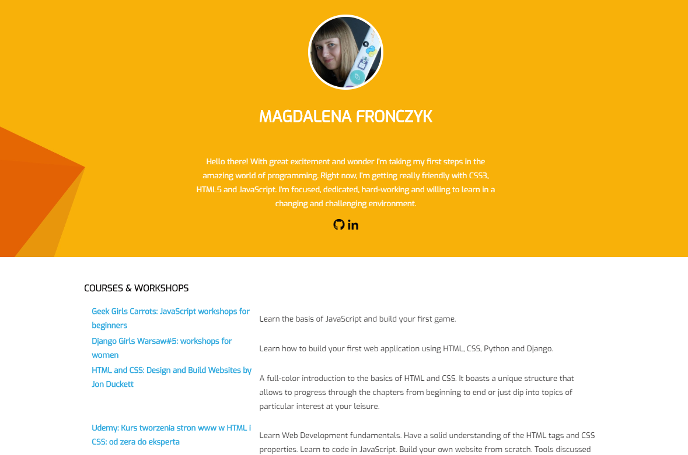

# CV

> This is a simple resume which helped me brush my basis of HTML and CSS up, and practice GIT.

## Table of contents

- [General info](#general-info)
- [Screenshots](#screenshots)
- [Technologies](#technologies)
- [Status](#status)
- [Inspiration](#inspiration)
- [Contact](#contact)

## General info

I've decided to complete this project in order to put my basic knowledge of HTML, CSS and GIT into practice. I based it on the template provided by [@flynerdpl](https://www.flynerd.pl/). It helped me learn how to design a legible CV with HTML5 and CSS, using CSS flexbox layout, RWD and Font Awesome for social media.

## Screenshots

## Technologies

- HTML5
- CSS3

## Status

Project is: _in progress_. I'm still updating info included in my CV and improving my code.

## Inspiration

Project inspired by [@flynerdpl](https://www.flynerd.pl/)

Thank you:

-Google Fonts - a collection of beautiful free fonts. A special thank you for Natanael Gama who designed the Exo font which I've used in this project.

-Font Awsome - a collection of fun,modern and free icons.

## Contact

Feel free to contact me!
